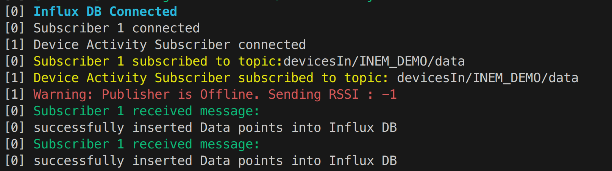
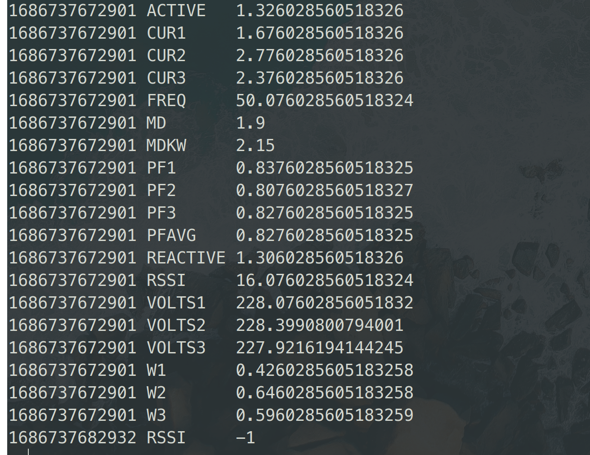

# Device Activity

Click up task: [https://app.clickup.com/t/85zt91ph2](https://app.clickup.com/t/85zt91ph2)

## Task

Implement a device activity Monitor in Node.js to publish offline status of publisher.

## Requirement

- Create publisher using `mqtt` npm package and `Emqx` broker. Use data packet format provided.
- Subscribe to topic and store data into Influx DB
- Redis Hashset using `ioredis` to store last time of message received.

## Thoughts

- We will create a mqtt client client_deviceActivity using node.js. It will connect to an MQTT broker and periodically checks the status of a publisher. If the publisher is offline, it will publish a data packet with a tag of "RSSI" and a value of -1 to the specified topic
- Then we will implement monitoring functionality using setInterval(). At each interval, it will check if the publisher is offline (isPublisherOnline = false). If so, it will create an activity data object with the tag "RSSI" and a value of -1. The data is then published to the activityTopic using the MQTT client's publish() method.

  ```
  const dataPacket = {
      device: devID,
      time: Date.now(),
      data: [
        {
          tag: 'RSSI',
          value: -1,
        },
      ],
    }
  ```

## Approach

```
1. // Set up MQTT client for device activity subscriber

client_deviceActivity.onConnect(() => {

   Handle connection event
   Subscribe to the publisher's topic

})


2. // listen to message

client_deviceActivity.onMessage((topic, message) => {

    Check if the received data is not RSSI
    if (true) {
         Set publisherActive flag to true
    }
    Store the current packet time in Redis

})


3. // Monitoring functionality

setInterval(() => {

  Get current time
  LastPacketTime from Redis
  Calculate difference

  if(timeDiff > connectionTimeout && publisherActive)
  then
      - Create dataPacket with RSSI value of -1
      - Publish dataPacket to the topic
      - Set publisherActive flag to false

}, connectionTimeout)
```

## Output



